# Automatic Router Reseter with web configuration ESP32 AsyncWebServer

author: Leszek Klich (c) 2025

* English: Automatic Router Resetter – Device Description

* Polski: Automatyczny Reseter Routera - Opis urządzenia. 

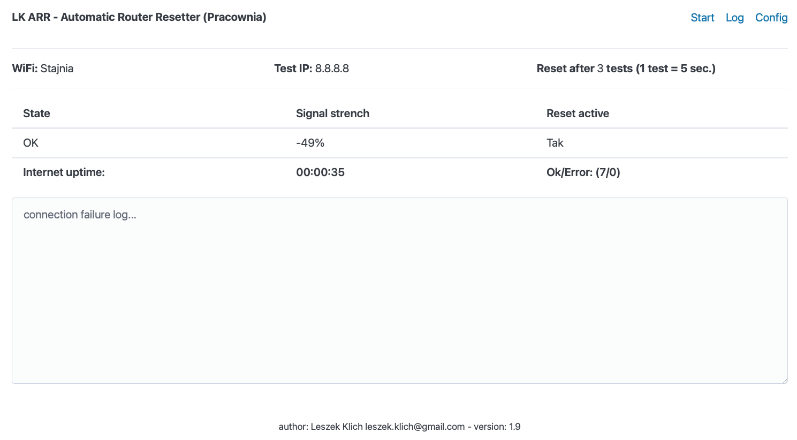

## English description

The automatic router resetter is designed to ensure uninterrupted operation of a home or business network. It is a system based on ESP32 Lolin Lite that monitors Internet access by periodically sending ICMP (ping) requests to a configured IP address. If no response is detected for a specified number of attempts (1 attempt every 5 seconds), the device activates a relay that disconnects the router's power supply for a programmed time (default 3 seconds), and then reconnects the power supply, performing a full restart of the network device.

Configuration is done via a web interface, which allows you to adjust parameters such as:

- SSID and Wi-Fi password so that the device can connect to the network,
- Target IP address for pinging (e.g. 8.8.8.8 or home gateway address),
- Number of unsuccessful ping attempts after which a restart will occur,
- Router power off time,

The device logs all restarts to a file along with the date and time, which allows for later analysis of the failure frequency. Thanks to this, the device is fully autonomous and allows for constant maintenance of a stable Internet connection without the need for manual user intervention.

### Advantages of the device

1. Autonomous operation - automatically detects connection problems and performs a reset without the need for user involvement. This is especially useful for routers and modems that occasionally hang or require regular restarts for correct operation.

2. Full configuration via the web interface - thanks to the built-in web server, the user can easily change the device parameters, adapting them to their needs. The ability to set a custom IP address for pinging and the number of attempts before restarting makes the solution flexible.

3. Accurate failure logging - recording resets in LittleFS memory allows you to track the history of internet problems. This allows you to analyze how often failures occur and take further diagnostic steps (e.g. replacing the router or changing the Internet provider).

4. Convenience - in the event of network problems, you do not have to manually reset the router - the device does this automatically. This is especially useful in homes, offices, and places where the internet must work uninterrupted (e.g. monitoring, smart home, NAS servers).

5. Cheap to build - ESP32 Lolin Lite is an energy-efficient microcontroller, thanks to which the device consumes minimal power and can operate for a long time without affecting electricity bills.

6. No need to interfere with the router - it does not require any modifications to the router - it is simply connected to its power supply and works independently. Thanks to this, it can be used with any model of router or modem.

7. Built-in support for connecting to an MQTT server - integration with Home Assistant.

### Application:

- Home Wi-Fi networks - especially if, like me, you have a poor Internet provider, which requires frequent router restarts.
- Offices and companies - ensuring a stable connection for employees, servers and systems.
- Monitoring and smart home systems - avoiding interruptions in access to IP cameras and home automation.
- Remote locations - the device can be used, for example, in summer houses or warehouses, where there is no constant supervision over the Internet connection.

## Polski

Automatyczny Resetator Routera

Urządzenie do automatycznego resetowania routera zostało zaprojektowane w celu zapewnienia nieprzerwanej pracy sieci domowej lub firmowej. Jest to system oparty na ESP32 Lolin Lite, który monitoruje dostęp do internetu poprzez okresowe wysyłanie zapytań ICMP (ping) na skonfigurowany adres IP. W przypadku wykrycia braku odpowiedzi przez określoną liczbę prób (1 próba co 5 sekund), urządzenie aktywuje przekaźnik, który odłącza zasilanie routera na zaprogramowany czas (domyślnie 3 sekundy), a następnie ponownie włącza zasilanie, wykonując pełny restart urządzenia sieciowego.

Konfiguracja odbywa się za pośrednictwem interfejsu WWW, który umożliwia dostosowanie parametrów takich jak:

- SSID oraz hasło Wi-Fi, aby urządzenie mogło łączyć się z siecią,
- Adres IP docelowy do pingowania (np. 8.8.8.8 lub adres bramy domowej),
- Liczba nieudanych prób pingowania, po której nastąpi restart,
- Czas odłączenia zasilania routera,

Urządzenie loguje do pliku wszystkie restarty wraz z datą i godziną, co umożliwia późniejszą analizę częstotliwości awarii. Dzięki temu urządzenie jest w pełni autonomiczne i pozwala na ciągłe utrzymanie stabilnego połączenia internetowego bez konieczności ręcznej interwencji użytkownika.

### Zalety urządzenia

1. Autonomiczne działanie - automatycznie wykrywa problemy z połączeniem i wykonuje reset bez potrzeby angażowania użytkownika. Jest to szczególnie przydatne w przypadku routerów i modemów, które sporadycznie zawieszają się lub wymagają regularnego restartu dla poprawnego działania.

2. Pełna konfiguracja przez interfejs WWW - dzięki wbudowanemu serwerowi WWW użytkownik może łatwo zmieniać parametry urządzenia, dostosowując je do swoich potrzeb. Możliwość ustawienia niestandardowego adresu IP do pingowania oraz liczby prób przed restartem sprawia, że rozwiązanie jest elastyczne.

3. Dokładne logowanie awarii - zapis resetów w pamięci LittleFS pozwala śledzić historię problemów z internetem. Dzięki temu można przeanalizować, jak często występują awarie i podjąć dalsze kroki diagnostyczne (np. wymiana routera lub zmiana dostawcy internetu).

4. Wygoda - w przypadku problemów z siecią nie trzeba ręcznie resetować routera – urządzenie zajmuje się tym automatycznie. Jest to szczególnie przydatne w domach, biurach, a także w miejscach, gdzie internet musi działać nieprzerwanie (np. monitoring, inteligentny dom, serwery NAS).

5. Tani w budowie - ESP32 Lolin Lite to energooszczędny mikrokontroler, dzięki czemu urządzenie pobiera minimalną ilość prądu i może działać przez długi czas bez wpływu na rachunki za energię elektryczną.

6. Brak konieczności ingerencji w router - nie wymaga żadnych modyfikacji routera – podłączane jest po prostu do jego zasilania i działa niezależnie. Dzięki temu można je stosować z dowolnym modelem routera lub modemu.

7. Wbudowana obsługa podłączenia do serwera MQTT - integracja z Home Assistant.


### Zastosowanie:

- Domowe sieci Wi-Fi – szczególnie gdy tak jak ja masz kiepskiego dostawcę Internetu, co wymaga częstych restartów routera.
- Biura i firmy – zapewnienie stabilnego połączenia dla pracowników, serwerów i systemów.
- Monitoring i systemy inteligentnego domu – unikanie przerw w dostępie do kamer IP i automatyki domowej.
- Zdalne lokalizacje – urządzenie można wykorzystać np. w domkach letniskowych lub magazynach, gdzie nie ma stałego nadzoru nad łączem Internetowym.

# Access to the device via the home network/dostęp do urządzenia przez sieć domową

Access can be via IP address or via the name http://ARR_102301.local

Dostęp może odbywać się przez adres IP lub poprzez nazwę http://ARR_102301.local

# Hardware

* ESP32 Lolin Lite 4MB Flash

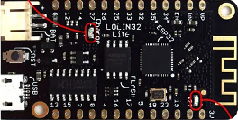

* Any DC-DC converter step DOWN. Routers are usually powered by 9-24V. Before you mount it, first set the output voltage of 5V with a regulator to power the ESP32./Dowolna przetwornica DC-DC step DOWN. Zwykle routery zasilane są napięciem 9-24V. Zanim ją zamontujesz, ustaw potencjometrem napięcie wyjściowe 5V do zasilania ESP32.

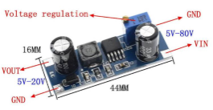

* Plug to power the router. Choose the right plug. Most often the plus is inside (check it)./Wtyczka zasilania routera. Dobierz odpowiednią wtyczkę. Najczęściej plus jest wewnątrz (sprawdź to).

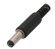

* Power socket where you connect the original Router power supply. Choose the appropriate one for your router power supply./Gniazdo zasilania, do którego podłączasz oryginalny zasilacz Routera. Dobierz odpowiednie do zasilacza routera.


* Button (ready module or make it yourself according to the diagram). It must be a pull up type. If you make it yourself, the resistor value is from 4.7kOm to 10kOm. VCC connect to 3.3V of ESP32 module. Output connect to GPIO15./Przycisk (gotowy moduł lub wyjkonaj samodzielnie według schematu). Musi być typu pull up. Jeśli wykonasz samodzielnie, wartość rezystora to od 4.7kOm do 10kOm. VCC podłącz do pinu 3.3V w module ESP32. Wyjście podłącz do GPIO15.

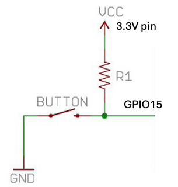

* LED and 330 ohm resistor for WiFi indicator


LED pinout/Dioda LED - wyprowadzenia


* micro USB plug for ESP32 power/wtyczka mikro USB do zasilania modułu ESP32 z przetwornicy.

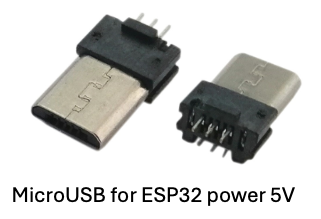

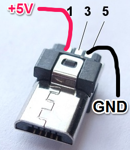

Power schema/Schemat zasilania

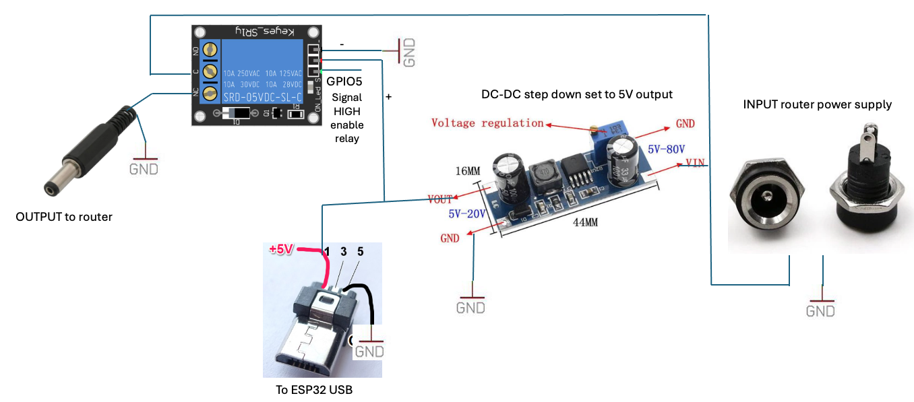

ESP32 pinout/Wyjścia ESP32

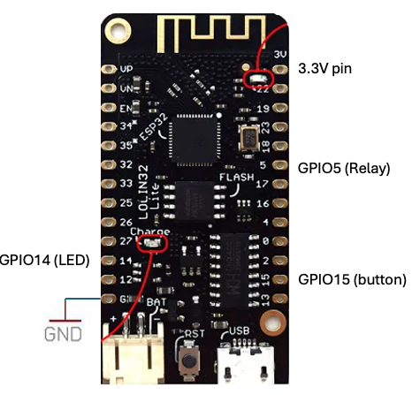

# Software

- ESP32 Arduino framework: framework-arduinoespressif32 (np. 3.0.10). 
- ESP32 Lolin Lite 4MB Flash
- Platform: VIsual Studio Code + PlatformIO
- Libraries: ESP32Async/AsyncTCP@3.3.2, ESP32Async/ESPAsyncWebServer@3.6.0, marian-craciunescu/ESP32Ping@^1.7, ArduinoThread 2.1.1 (Ivan Seidel), ESP32Ping 1.7 (Daniele Colanardi, Marian Craciunescu), bblanchon/ArduinoJson@^7.3.0, knolleary/PubSubClient@^2.8.

**platformoio.ini**
```
[env:lolin_lite]
platform = https://github.com/platformio/platform-espressif32.git
board = lolin32_lite
monitor_speed = 115200
upload_protocol = esptool
board_buid.flash_mode = dout
upload_speed = 460800
board_build.mcu = esp32
framework = arduino
board_build.filesystem = littlefs
lib_compat_mode = strict
lib_ldf_mode = chain
lib_deps = 
	ESP32Async/AsyncTCP@3.3.2
	ESP32Async/ESPAsyncWebServer@3.6.0
	marian-craciunescu/ESP32Ping@^1.7
	bblanchon/ArduinoJson@^7.3.0
	knolleary/PubSubClient@^2.8
```

### Upload

* Upload data folder: go to PlatffomIO menu and execute/przejdź do menu PlatffomIO i wykonaj **Upload Filesystem Image**

* Nest upload firmware using command **Upload**/Następnie prześlij firmware poleceniem **Upload**.


### Pinout:

- GPIO15 - button swithe (pull up)
- GPIO14 - LED Network status
- GPIO5  - Relay (HIGH signal enable coil)


# Factory reset/reset do ustawień fabrycznych

* English: To restore the device to factory settings, press the button and turn the device on. Hold the button for 10 seconds. The LED will flash. When it stops flashing, release the button. After the first power-on or after a factory reset, the device will enter configuration mode. The device will be an Access Point with the network name: ARR_10230. Connect to this network (password: 12345678) and open the page 192.168.4.1 to go to settings. Login and password for configuration are admin/admin. In the settings, configure the WiFi network and  password of your home router and others options. The rest of the configuration parameters can be left as default. After saving the settings, the device will restart and run as a client of your home WiFi network. Now device will monitor the Internet and automatically restart the router if it detects no Internet access for a specified period of time.


* Polish: Aby przywrócić urządzenie do ustawień fabrycznych, wciśnij przycisk i włącz urządzenie. Trzymaj przycisk wciśnięty przez około 10 sekud. Dioda LED będzie migać. Gdy przestanie migać, puść przycisk. Urządzenie przywróci ustawienia fabryczne i uruchomi się ponownie. Po pierwszym włączeniu urządzenia lub po resecie do ustawień fabrycznych, urządzenie przejdzie w tryb konfiguracji. Stanie się Access Pointem o nazwie sieci: ARR_10230. Podłącz się do tej sieci (hasło: 12345678) i otwórz stronę 192.168.4.1 aby przejść do ustawień. Domyślny login i hasło do konfiguracji to admin/admin. W ustawieniach skonfiguruj sieć WiFi, hasło routera domowego oraz pozostałe opcje. Resztę parametrów konfiguracyjnych można pozostawić jako domyślne. Po zapisaniu ustawień urząedzenie zrestartuje się i będzie działać jako klient twojej domowej sieci WiFi. Od tej chwili urządzenie będzie monitorować sieć Internet i automatycznie restartować router jeśli wykryje brak dostępu do Internetu przez okreśony czas.


# Debbuging/debugowanie

* English: You can debug via serial port, but the full log can be found in the LOG option.

* Debugowanie: możesz debugować przez port serial, ale pełny log działania i błędów znajdziesz także w opcji LOG. 

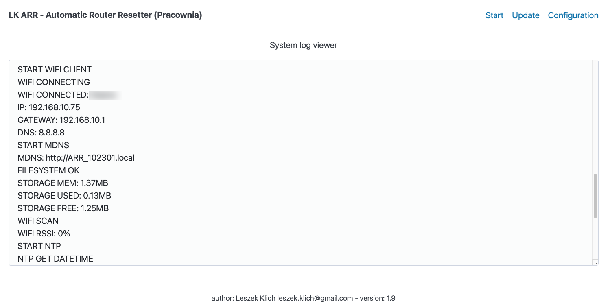


# Configuration/konfiguracja

Access to configuration via IP address or **http://ARR_102301.local**
Configuration is divided into sections.

Dostęp do konfiguracji przez adres IP lub adres **http://ARR_102301.local**
Konfiguracja podzielona jest na sekcje.

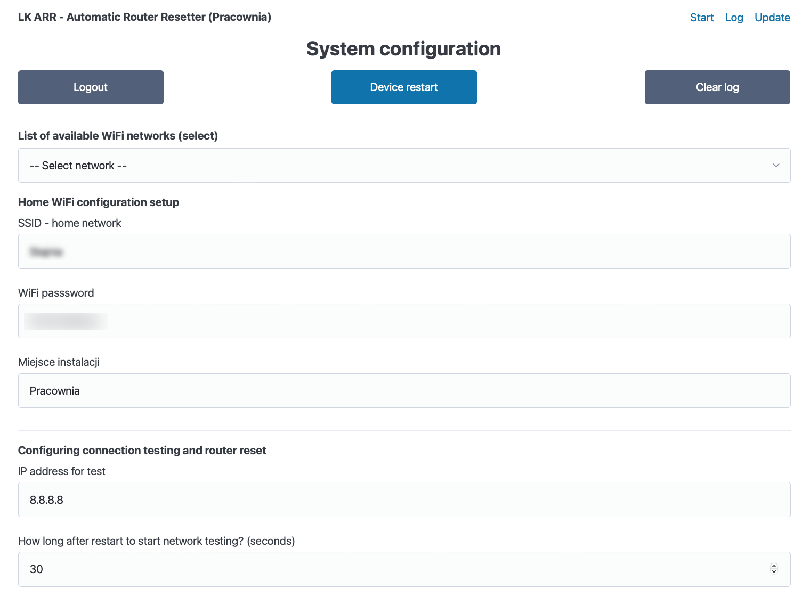

## Sekcja: Home WiFi configuration setup

* List of available WiFi networks (select) - list of detected WiFi networks nearby. If it does not display, wait a moment and refresh the page. If you select a network, it will appear in the SSID - Home network field. **Polish**: Lista wykrytych sieci WiFi w pobliżu. Jeśli nie wyświetla, poczekaj chwilkę i odśwież stronę. Jeśli wybierzesz sieć, pojawi się ona w polu SSID - Home network.

* SSID - Home network - The network you selected from the list above will appear here, but you can also enter it manually. **Polish**: tutaj pojawi się sieć wybrana z listy powyżej, ale możesz też wpisać ją ręcznie.

* WiFi passsword - Password for your home network so that the device can connect. **Polish**: hasło do sieci domowej, aby urządzenie mogło się połączyć.

* Instalation place - Installation location. Here you can enter where you installed the device. For example, a guest room or garage. **Polish**: miejsce instalacji. Możesz tutaj wpisać, gdzie zainstalowałeś urządzenie. Na przykład pokój gościnny czy garaż.

## Sekcja: Configuring connection testing and router reset

* IP address for test - The Internet test consists of performing a ping operation on an IP address. You can leave the default address 8.8.8.8 or provide your own test. In my case, the fiber optic edge router usually hangs, which has the address 192.168.0.1 and I have this IP address set, but it can be any address on the network. **Polish**: Test Internetu polega na wykonywaniu operacji ping na adres IP. Można zostawić adres domyślny 8.8.8.8 lub podać włąsny test. U mnie zwykle zawiesza się światłowodowy router brzegowy, który ma adres 192.168.0.1 i ten adres IP mam ustawiony, ale może być to dowolny adres w sieci. 

* How long after restart to start network testing? (seconds) - If the router is restarted, it needs some time to start. You can't test the Internet right away because the device will constantly restart the router. This option is used to delay the start of tests after each restart. Usually 30 seconds is enough for the router to start. You can measure the startup time of your router, add a few seconds and enter this value. **Polish**: Jeśli router zostanie zrestartowany, to potrzebuje trochę czasu aby się uruchomić. Nie można od razu testować Internetu, ponieważ urządzenie będzie ciągle restartować router. Ta opcja służy do opóźnienia rozpoczęcia testów po każdym restarcie. Zwykle 30 sekund wystarczy, aby router się uruchomił. Możesz zmierzyć czas uruchamiania twojego routera, dodać kilka sekund i wprowadzić tę wartość.

* Reboot router for seconds - If the system detects no Internet, it will turn off the router's power. Some routers require a longer power outage. Here you can enter how many seconds the router will be off before it is turned on again. In this option, you can adjust this time. In most cases, 3 seconds is enough. **Polish**: Jeśli system wykryje brak Internetu, wyłączy zasilanie routera. Niektóre routery wymagają dłuższej przerwy braku zasilania. Tutaj możesz wpisać, przez ile sekund router będzie wyłączony, zanim zostanie włączony ponownie. W tej opcji możesz dostosować ten czas. W większości przypadków wystarczy 3 sekundy.

* After how many incorrect attempts should the router be restarted? - After how many failed tests (pings) should the router be restarted? One test (ping) is 5 seconds. You can choose the number of tests before the router is restarted. **Polish**: Po ilu błędnych testach (pingach) router ma zostać zrestartowany? Jeden test (ping) to 5 sekund. Możesz dobrać ilość testów, zanim router zostani zrestartowany.

## Section: Enable DHCP (automatic network configuration)

* Configure automatically via DHCP (recommended) - This recommended option enables the device's automatic network configuration mode. By selecting this option, the device will download the network settings itself. It will be available at: http://ARR_102301.local **Polish**: Ta zalecana opcja włącza tryb automatycznej konfiguracji sieci urządzenia. Dzięki zaznaczeniu tej opcji urządzenie samo pobierze ustawienia sieci. Będzie ono dostępne pod adresem: http://ARR_102301.local

## Section: Manual network configuration device

Note - if *Configure automatically via DHCP* is checked, this section is ignored.

Uwaga - jeśli opcja *Configure automatically via DHCP* jest zaznaczona, ta sekcja jest ignorowana. 

* IP address - Device IP address/Adres IP urządzenia. 

* Netmask - Device netmask/Maska sieci urządzenia.

* Gateway (router address) - Gateway config/Brama do Innernetu (zwykle adres Twojego routera).

* DNS server (for egz. router address) - DNS server. This may be the address of your router, the Google 8.8.8.8 server, or another DNS server./Adres DNS sieci. Może być to adres twojego routera, serwer Google 8.8.8.8 lub inny serwer DNS.

## Section: Security - login and password for device configuration

Here you can secure the Resetera configuration and set a password for accessing the configuration. The main page (information) is available without a password, but to configure it, you will need to enter a login and password.

Tutaj możesz zabezpieczyć konfigurację Resetera i skonfigurować hasło dostępu do konfiguracji. Strona główna (informacje) jest dostępna bez hasła, ale aby dokonać konfiguracji, będzie trzeba podać login i hasło.

* User name (admin) - Username for configuration page (admin by default)./Login do logowania na stronę konfiguracji (domyślnie admin).

* User password - Password for configuration site/Hasło dostępu do konfiguracji (domyślnie admin).

## Section: MQTT broker connection config (Home Assisstant)

Note: The reverse logic is used: the relay off powers the router, and the relay on turns it off for a few seconds. In the case of MQTT, the normal state is the relay off when the router is powered. In this case, the ON state is sent.

Uwaga: Zastosowano logikę odwrotną: przekaźnik wyłączony zasila router, zaś przekaźnik włączony, wyłącza go na kilka sekund. W wypadku MQTT stanem normalnym jest przekaźnik wyłączony, gdy router jest zasilany. W tym wypadku wysyłany jest stan ON.

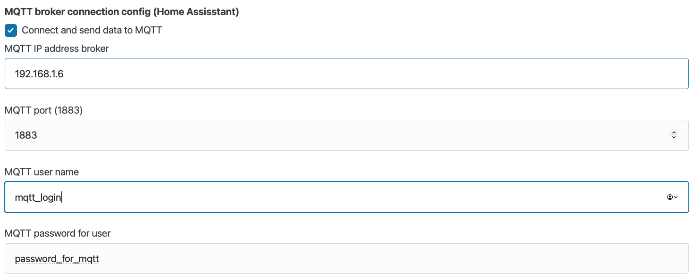

* Connect and send data to MQTT - If this option is enabled, Resetter will connect to the MQTT server and send the relay status./Jeśli ta opcja będzie włączona, Reseter będzie łączył się z serwerem MQTT i wysyłał stan przekaźnika.  

* MQTT IP address broker - MQTT boker IP address/adres IP brokera MQTT, np. Mosquitto.

* MQTT port (1883) - MQTT broker port/port, na którym działa broker.

* MQTT user name - Broker username/nazwa użytkownika brokera MQTT.

* MQTT password for user - Broker password/hasło do połączenia z brokerem.


# Update firmware/aktualizacja oprogramowania urządzenia

* English: The device can be updated by uploading the firmware via USB or via the Update option. The firmware must have the .arr extension. If you build the firmware in PlatformIO, you will get a firmware.bin file. Change its extension to firmware.arr and update the device via the browser.


* Polish: Urządzenie można aktualizować wgrywając firmware przez port USB lub poprzez opcję  Update. Firmware musi mieć rozszerzenie .arr Jeśli zbudujesz firmware w PlatformIO, otrzymasz plik firmware.bin. Zmień jego rozszerzenie na firmware.arr i zaktualizuj urządzenie przez przeglądarkę.

* English: Wersja jest zapisana w pliku include/version.h

* Polish: The version is saved in the file include/version.h

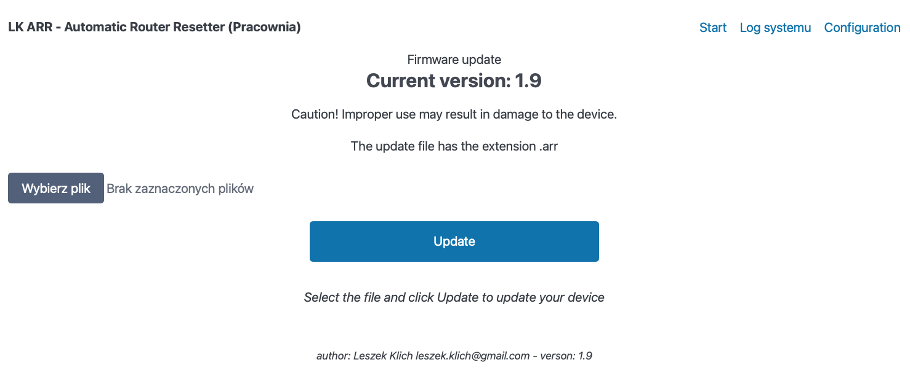

# Licence/licencja na projekt i oprogramowanie

*English version:*

1. The software is available free of charge for home and non-commercial use. You may install, use and copy it for your own use.

2. Restrictions: It is prohibited to use the software for commercial purposes.

3. No warranty: The software is provided as is, without any warranty. The author is not responsible for any damages resulting from the use of the software.


*Licencja:*

1. Oprogramowanie jest dostępne bezpłatnie do użytku domowego i niekomercyjnego. Możesz je instalować, używać oraz kopiować na własny użytek.

2. Ograniczenia: zabrania się wykorzystywania oprogramowania w celach komercyjnych.

3. Brak gwarancji: oprogramowanie jest dostarczane tak, jak jest, bez jakichkolwiek gwarancji. Autor nie ponosi odpowiedzialności za jakiekolwiek szkody wynikające z użycia oprogramowania.

